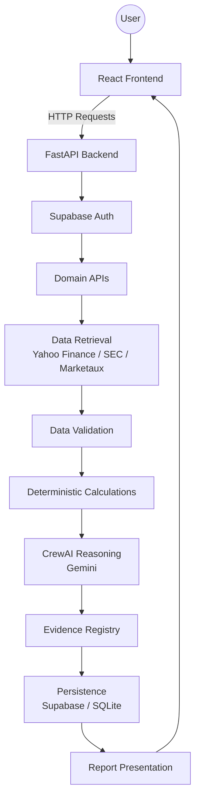

# AI Investment Research

A production-oriented AI-powered financial research terminal built with CrewAI, Gemini, FastAPI, and React. Alpha Terminal provides autonomous, agentic financial research generation, coupled with tools for market discovery, simulated portfolio tracking, and comprehensive investment evaluation.

## Features

- **AI Research Architecture**: Asynchronous multi-agent generation of comprehensive investment reports.
- **Market Data**: Real-time bounded market insights, pricing, and 1-month historical charts via Yahoo Finance.
- **Financial Calculations**: Deterministic fundamental financial calculations and real-time paper portfolio valuations.
- **Evidence & Provenance**: Robust citation and evidence registry to verify AI claims.
- **Authentication & Security**: Supabase JWT authentication, protected frontend routes, and Row Level Security (RLS) on the backend.
- **Persistence**: Relational database persistence across multiple backends (SQLite, Supabase) with full user isolation.

## Product Modules

### Markets
The Market module offers a real-time overview of the market.
- **Overview & Movers**: Provides the day's top gainers and losers from a curated universe of major US equities.
- **Quotes**: Detailed ticker lookups yielding current prices, day ranges, 52-week ranges, volume, market cap, and recent 1-month historical pricing charts.

### Stock Screener
A dynamic, fundamental screener targeting major US equities.
- **Filters**: Filter stocks based on Price, P/E Ratio, Market Cap, and Dividend Yield.
- **Results**: Responsive table dynamically populated with real-time fundamentals.

### Paper Portfolio
**PAPER PORTFOLIO ONLY.** This module is for simulated tracking and is not connected to any real-world brokerage. It does not execute real trades.
- **Capabilities**: Track simulated holdings with exact quantity and average cost.
- **Valuation**: Calculates total invested capital, total real-time market value, and deterministic unrealized P/L (Total and Percentage).
- **CRUD**: Full ability to add, edit, or delete simulated holdings.

### Watchlist
- **Tracking**: Maintain a user-specific list of ticker symbols.
- **Integration**: Start deep research directly from watchlist items.
- **Security**: Complete isolation using Supabase RLS.

### Research History
- Track the lifecycle of generated asynchronous research jobs.
- Access historically generated investment reports containing specialist analysis, evidence registries, and generated evaluation metrics.

## Technology Stack

- **Frontend**: React 19, Vite, TypeScript, React Router, Recharts, Lucide React.
- **Backend**: Python, FastAPI, CrewAI, Google Gemini, Pydantic, yfinance.
- **Database**: Supabase (PostgreSQL), SQLite.
- **Authentication**: Supabase Auth (JWT).

## Architecture

The system follows an asynchronous, secure multi-tier architecture:



## Project Structure

```text
CrewAI/
├── api/                  # FastAPI routes and server configuration
├── db/                   # Database abstraction layer (Supabase, SQLite, Mock)
├── frontend/
│   ├── src/
│   │   ├── api/          # Frontend API client
│   │   ├── components/   # Reusable React components (Layout, Auth)
│   │   ├── contexts/     # Auth Context Provider
│   │   ├── hooks/        # Custom React hooks
│   │   ├── pages/        # Route-level pages (Markets, Portfolio, etc.)
│   │   └── types/        # TypeScript interfaces
├── services/             # Core business logic and bounded data services
├── supabase/
│   └── migrations/       # SQL schemas and RLS definitions
├── tests/                # Pytest suites (unit & integration)
├── tools/                # Specialized CrewAI tools (MarketData, SEC, etc.)
└── utils/                # Helper utilities and validators
```

## Prerequisites

- Node.js 20+
- Python 3.11+
- Google Gemini API Key
- Supabase Account

## Installation

1. **Clone the repository:**
```bash
git clone https://github.com/vyashemant/CrewAI-AiAgent.git
cd CrewAI-AiAgent
```

2. **Backend Setup:**
```bash
# Windows
python -m venv venv
venv\Scripts\activate

# Linux/macOS
python -m venv venv
source venv/bin/activate

# Install dependencies
pip install -r requirements.txt
```

3. **Frontend Setup:**
```bash
cd frontend
npm install
```

## Environment Variables

The project strictly separates public frontend configuration from secure server-side secrets.

### Backend (`.env`)
Required variables for the FastAPI server:
```env
GEMINI_API_KEY=your_gemini_api_key_here
SEC_USER_AGENT=YourAppName your-email@example.com
MARKETAUX_API_KEY=your_marketaux_api_key_here
DATABASE_BACKEND=supabase  # Options: supabase, sqlite, mock
SUPABASE_URL=your_supabase_project_url
SUPABASE_SECRET_KEY=your_supabase_secret_key
```

### Frontend (`frontend/.env`)
Public configuration for the React application. **Never place secrets here.**
```env
VITE_API_BASE_URL=http://localhost:8000
VITE_SUPABASE_URL=your_supabase_project_url
VITE_SUPABASE_ANON_KEY=your_public_anon_key
```

## Supabase Setup

To use the production-ready `DATABASE_BACKEND=supabase`:

1. **Create Supabase project**: Create a new project in the Supabase dashboard.
2. **Configure authentication**: Enable Email/Password authentication.
3. **Link repository**: Use the Supabase CLI to link your local repository.
   ```bash
   supabase link --project-ref your-project-id
   ```
4. **Apply migrations**: Apply the migrations listed below in order.
   ```bash
   supabase db push
   ```
5. Configure your backend `.env` using the Service Role Secret Key.
6. Configure your frontend `.env` using the Public Anon Key.

### Database Migrations
The following migrations are present in `supabase/migrations/` and must be applied:
- `20260908_create_research_jobs.sql`
- `20260911_add_started_at.sql`
- `20260912_add_user_id.sql`
- `20260913_create_watchlist.sql`
- `20260914_create_portfolio.sql`

## Running Locally

**Start Backend (FastAPI)**
```bash
# From project root
uvicorn api.main:app --reload --port 8000
```
Backend runs at: `http://localhost:8000`

**Start Frontend (React/Vite)**
```bash
# From frontend/ directory
npm run dev
```
Frontend runs at: `http://localhost:5173`

## API Documentation

The backend exposes the following REST APIs, secured via JWT Bearer tokens matching the Supabase Auth signatures.

| Method | Path | Auth Req | Purpose |
|--------|------|----------|---------|
| `GET`  | `/health` | No | System health check. |
| `POST` | `/api/v1/research` | Yes | Dispatch an async research job. Body: `{"company": "...", "ticker": "..."}`. |
| `GET`  | `/api/v1/research/{job_id}` | Yes | Fetch job status and resulting report JSON. |
| `GET`  | `/api/v1/research/history` | Yes | Retrieve past research reports. Query: `?limit=20`. |
| `GET`  | `/api/v1/watchlist` | Yes | Get the user's specific watchlist. |
| `POST` | `/api/v1/watchlist` | Yes | Add to watchlist. Body: `{"ticker": "..."}`. Returns `409` if exists. |
| `DELETE`| `/api/v1/watchlist/{id}` | Yes | Remove from watchlist. |
| `GET`  | `/api/v1/markets/quote` | No | Fetch real-time ticker data. Query: `?ticker=AAPL`. |
| `GET`  | `/api/v1/markets/movers` | No | Fetch top gainers and losers from the bounded universe. |
| `GET`  | `/api/v1/markets/screener` | No | Filter equities. Query: `?min_pe=10&max_pe=20` etc. |
| `GET`  | `/api/v1/portfolio` | Yes | List paper portfolio holdings. |
| `POST` | `/api/v1/portfolio` | Yes | Add a paper holding. Body: `{"ticker": "...", "quantity": 10, "average_cost": 150.0}`. |
| `PATCH`| `/api/v1/portfolio/{id}` | Yes | Update holding quantities or cost basis. |
| `DELETE`| `/api/v1/portfolio/{id}` | Yes | Remove a paper holding. |

## Database

Alpha Terminal features a robust database abstraction layer (`db.database.DatabaseBackend`). The active backend is controlled by the `DATABASE_BACKEND` environment variable.

- `DATABASE_BACKEND=supabase`: The production standard. Relies on Supabase PostgreSQL with strict Row Level Security (RLS).
- `DATABASE_BACKEND=sqlite`: A local fallback that persists to `crewai.db`. Uses identical logical isolation checks as RLS.
- `DATABASE_BACKEND=mock`: A strictly in-memory transient store used explicitly for testing. This is not an automatic fallback for production.

**Core Tables:**
- `research_jobs`: Tracks the async lifecycle and JSON outputs of AI research.
- `watchlist`: Stores user-specific isolated ticker tracks.
- `portfolio_holdings`: Stores user-specific simulated equity allocations.

## Testing

Alpha Terminal is thoroughly tested using `pytest`.

```bash
# Run the complete API test suite
$env:PYTHONPATH="."
pytest
```
*Note for macOS/Linux use `PYTHONPATH="." pytest`.*

Tests cover API contracts, consistency, mock DB validations, stale job recovery, financial edge cases, and pipeline stability.

## Security Notes

- **Environment Variables**: Never commit `.env` files containing secrets.
- **Supabase Keys**: The frontend ONLY receives the `VITE_SUPABASE_ANON_KEY`. The `SUPABASE_SECRET_KEY` must strictly remain on the backend.
- **Data Protection**: Supabase Row Level Security (RLS) policies enforce that users can only read, insert, update, or delete their own isolated `user_id` rows. Bypassing RLS is strictly prohibited.
- **Identity Verification**: The backend relies entirely on the securely decoded JWT identity token to perform actions, discarding unverified client assertions of identity.
- **Simulated Scope**: The paper portfolio is completely simulated and does not utilize any broker API keys or transmit trade execution signals.

## Known Limitations

- **Market Universe**: The stock screener and market movers currently evaluate a bounded universe of major equities rather than the entirety of the US stock market, to prevent extreme concurrent load and rate-limiting against Yahoo Finance.
- **YFinance Reliability**: Fetching live quotes is dependent on the uptime and throttling limits of the unofficial `yfinance` library.
- **Research Generation Time**: Comprehensive autonomous research via CrewAI and Gemini can take multiple minutes to generate, depending on complexity.

## Disclaimer

**For Research and Informational Purposes Only.**
Alpha Terminal and its generated AI reports do not constitute personalized financial or investment advice. The paper portfolio module does not execute real trades, does not connect to real brokerages, and is purely for educational simulation. Perform your own due diligence before making real investment decisions.
